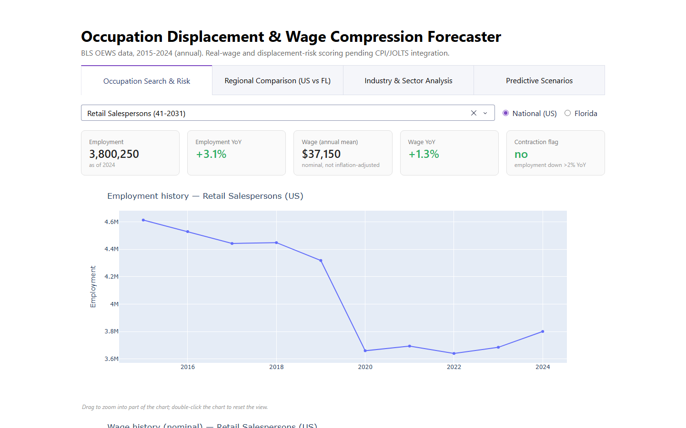

# Occupation Displacement & Wage Compression Forecaster



[](https://opensource.org/licenses/MIT)
[](https://www.python.org/downloads/)
[](https://dash.plotly.com/)

A labor-market analytics pipeline forecasting occupation-level employment trends, built on real BLS data (not synthetic) — with a South Florida regional lens. **Status: in progress** — 4 of 5 dashboard tabs are built and deployed; see [Status & Limitations](#status--limitations) for exactly what's done vs. pending.

**Live dashboard: [labor-market-displacement-forecaster.onrender.com](https://labor-market-displacement-forecaster.onrender.com/)** — hosted on Render's free tier, which spins the app down when idle, so the first load after a quiet period can take up to a minute.

## Overview

Which jobs are shrinking, and which are quietly losing purchasing power even while nominal pay rises? This project pulls BLS Occupational Employment and Wage Statistics (OEWS) into a real 10-year annual panel (~800 occupations, national + Florida), trains a LightGBM model to forecast next-year employment, and ships an interactive dashboard for exploring the results — including a transparent, documented what-if scenario tool. (The "losing purchasing power" half is the planned next step: it needs CPI data that isn't integrated yet — see [Status & Limitations](#status--limitations).)

**Real, verified results:**
- 📊 **10-year OEWS panel**: 2015–2024, 789–831 occupations per year (15,967 occupation × region × year rows), national + Florida
- 🤖 **Employment forecaster**: LightGBM, test RMSE ≈ 16,500, MAPE ≈ 12.1%, median error ≈ 7.4%
- 🐛 **A real bug found and fixed mid-build**: an earlier model version mispredicted the largest US occupation by ~60%, even on training data — see [docs/METHODOLOGY.md](docs/METHODOLOGY.md#model) for the root cause and fix (predicting growth rate instead of absolute employment level)
- 🗺️ **Unexpected finding**: Florida pays less than the national figure, not more. Compared head-to-head on the same occupation, Florida's median mean annual wage is ~7% lower (84% of 778 comparable occupations pay less in FL); the Regional Comparison tab's ~9% is the gap between the two *medians across occupations*. All nominal — not cost-of-living adjusted — contrary to the +3–8% regional premium the original project brief assumed. See [docs/METHODOLOGY.md](docs/METHODOLOGY.md#florida-vs-national-wages).
- 🏭 **Industry-sector breakdown**: 20 NAICS sectors (~430 occupations per sector on average), 83,577 occupation × sector × year rows, national level

## Quick Start

```bash
git clone https://github.com/brianravelo28/labor-market-displacement-forecaster.git
cd labor-market-displacement-forecaster
pip install -r requirements.txt
python app/app.py
# -> http://localhost:8051
```

The processed datasets and trained model are committed under `data/processed/`, so the dashboard runs immediately — no pipeline run required.

### Rebuild everything from raw BLS data (optional)

```bash
# Download BLS OEWS annual archives, 2015-2024 (~800MB total, ~30-40 min the first time)
python data/fetch_oews.py
python data/fetch_oews_industry.py

# Engineer growth/trend features
python src/build_features.py
python src/build_industry_features.py

# Retrain the employment forecaster
python src/train_model.py
```

The scripts self-identify to BLS with a `User-Agent` (BLS serves an "Access Denied" page to generic browser user agents). Before running the downloads, create a `.env` file in the repo root containing `BLS_CONTACT_EMAIL=you@example.com` (read by `src/config.py`; `.env` is git-ignored). `BLS_API_KEY` is optional and only relevant to the JOLTS/CPI scripts.

### JOLTS and CPI (written, not yet integrated)

```bash
python data/fetch_jolts.py   # industry-level vacancy/hires/separations rates
python data/fetch_cpi.py     # CPI-U, for inflation-adjusted wage compression
```

These scripts exist but their output isn't part of the shipped dataset, features, or model yet — see [Status & Limitations](#status--limitations). The unregistered BLS API allows only 25 queries/day; `fetch_jolts.py` caches every successful response so a quota hit never costs already-fetched batches.

### Explore the notebooks

```bash
pip install -r requirements-dev.txt   # adds jupyter + matplotlib on top of requirements.txt
jupyter notebook notebooks/
```
- `01_eda_occupation_panel.ipynb` — employment/wage distributions, regional comparison, growth trends
- `02_model_evaluation.ipynb` — model metrics, feature importance, the Retail Salespersons bug case study

## Dashboard

4 tabs, each verified against real data (locally and in production):

| Tab | What it shows |
|---|---|
| **Occupation Search & Risk** | Search any occupation, see employment/wage history, YoY trend, and a contraction flag (employment down >2% YoY), US or FL. A full displacement *risk score* is not implemented yet — see [Status & Limitations](#status--limitations). |
| **Regional Comparison** | US vs. Florida: employment growth (median with 25th–75th percentile whiskers, since a median-only bar hid how much occupations actually vary), median wage level, and the share of occupations with wage decline or contraction |
| **Industry & Sector Analysis** | Pick a NAICS sector, see a wage-growth-vs-employment-change scatter and top movers. Occupations under 500 employees within a sector — in either year compared — are excluded from the ranked tables (sampling noise), though still shown in the scatter |
| **Predictive Scenarios** | GDP contraction / automation / immigration sliders applied to the trained model's forecast, with documented linear-assumption transparency (no macro elasticity model exists here — treat as directional) |

A 5th tab (Fairness & Equity audit) is **not built** — the original plan's approach of inferring gender/age from job-posting text is methodologically weak, and this build has no job-postings data source at all. Needs a sounder methodology before implementation.

## Deployment (Render)

The repo is Render-ready as-is:

1. On [render.com](https://render.com), **New > Blueprint**, point it at this repo — `render.yaml` configures the build (`pip install -r requirements.txt`) and start command.
2. Or create a **New > Web Service** manually (Python 3.11+, free plan is fine) with build command `pip install -r requirements.txt` and start command:

   ```bash
   gunicorn app.app:server --bind 0.0.0.0:$PORT --worker-class gthread --workers 1 --threads 4 --timeout 120
   ```

**Why a threaded worker:** Dash fires every tab's callbacks as simultaneous requests on page load. With gunicorn's default single sync worker those requests queue one at a time, and on Render's free tier the LightGBM-loading Predictive Scenarios callback could wait long enough to hit the 30-second default timeout — surfacing as intermittent `502`s and a blank tab. Threads share the already-loaded data/model inside one process (unlike extra worker processes, which would each duplicate it).

**Gotcha:** for a service created manually, the Start Command lives in Render's dashboard settings — editing `Procfile`/`render.yaml` later does *not* change an existing service. Update it under **Settings > Start Command**.

No environment variables or secrets are required — the dashboard reads only the processed CSVs and trained model committed under `data/processed/` (unlike the raw BLS archives, which are git-ignored; see [.gitignore](.gitignore) for why: Render can't reliably regenerate them at build time, since BLS's API has had multi-day outages).

`app/app.py`'s `if __name__ == "__main__"` block is for local dev (`python app/app.py`; reads `PORT`/`DASH_DEBUG` env vars, defaults to port 8051 with debug on). In production, gunicorn serves `app.app:server` per the `Procfile`.

## Project Structure

```
labor-market-displacement-forecaster/
├── README.md              # this file
├── requirements.txt        # runtime deps (what Render installs)
├── requirements-dev.txt    # + jupyter/matplotlib for notebooks
├── Procfile                 # gunicorn start command
├── render.yaml              # Render Blueprint config
├── LICENSE                 # MIT
├── .gitignore
├── data/                   # acquisition scripts (BLS OEWS/JOLTS/CPI fetchers) + processed/ (tracked, see Deployment)
├── src/                    # feature engineering + model training
├── notebooks/              # EDA and model evaluation (executed, real outputs)
├── app/                    # Plotly Dash dashboard
└── docs/                   # schema, methodology, data source citations
```

See [docs/SCHEMA.md](docs/SCHEMA.md) for exact column definitions and [docs/METHODOLOGY.md](docs/METHODOLOGY.md) for the full data-architecture and modeling writeup.

## Data Sources

- **BLS OEWS** (annual employment/wage by occupation): downloaded directly as archive files, not via the timeseries API — BLS doesn't retain multi-year OEWS history under stable series IDs. See [docs/METHODOLOGY.md](docs/METHODOLOGY.md) for how this was verified.
- **BLS JOLTS** (monthly vacancy/hires/separations, industry-level only — not occupation-level): not yet pulled or integrated.
- **BLS CPI-U** (for real/inflation-adjusted wages): not yet pulled or integrated. The series ID the script uses (`CUUR0000SA0`) was confirmed to return data from BLS's live API on 2026-10-07.

Full citations and API documentation links: [docs/CITATIONS.md](docs/CITATIONS.md).

## Status & Limitations

- **Done**: OEWS annual panel + engineered features, industry-sector breakdown, LightGBM employment forecaster (bug-fixed), dashboard Tabs 1–4 deployed on Render, 2 executed EDA/evaluation notebooks.
- **Next — JOLTS and CPI integration**: a multi-day BLS API outage in August 2026 delayed these pulls; the API is reachable again, so what remains is running the fetch scripts, merging the results into the feature table, and retraining. That unlocks the real-wage compression flag and a fuller displacement risk score (today only a simplified growth-rate-based low/moderate/high threshold exists, used by the Predictive Scenarios tab).
- **Not started**: Fairness/equity audit (Tab 5) — needs a methodology decision, not just more data.
- **Known data-quality caveats**: occupations with employment in the tens/hundreds show large YoY % swings from OEWS sampling variance — the sector tab filters these out of its rankings, but the notebook's top-movers tables don't. Some BLS estimates are carried forward unchanged between releases (it's why Florida's median employment growth lands on exactly 0.0%). Details in [docs/METHODOLOGY.md](docs/METHODOLOGY.md#known-limitations).
- **Cadence**: annual, not monthly (OEWS is a point-in-time annual survey; see methodology doc for why the original monthly-cadence plan didn't match reality).

## License

MIT License — see [LICENSE](LICENSE).
